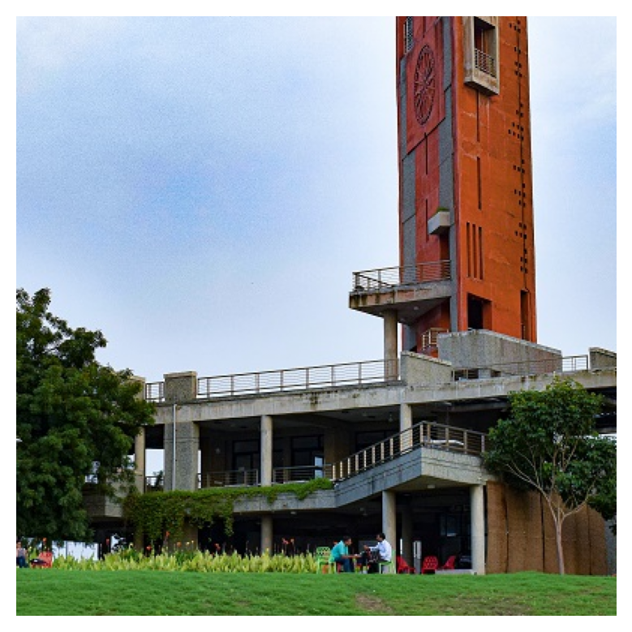
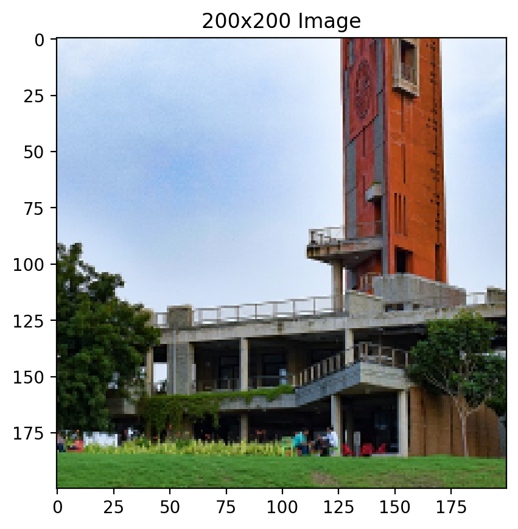
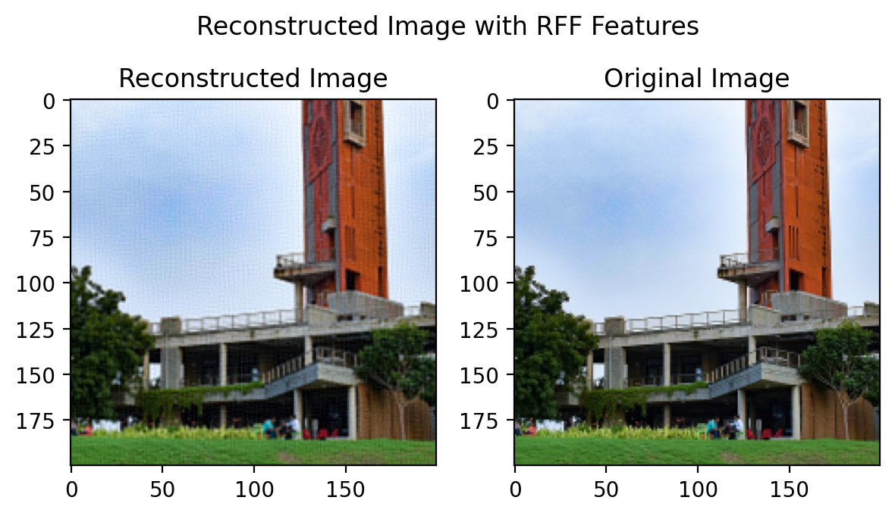
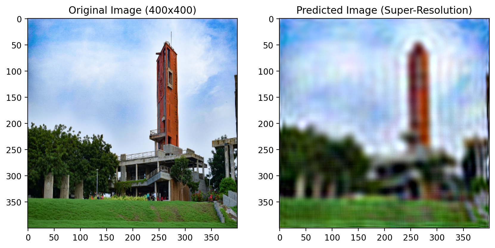

# Image Super-Resolution using Random Fourier Features and Linear Regression

## Overview
This project performs image super-resolution to enhance the resolution of a given image by a factor of 2. The methodology involves downsampling the original high-resolution image, using Random Fourier Features (RFF) and linear regression to predict the high-resolution image, and comparing the results both qualitatively and quantitatively.

## Task Instructions


Perform super-resolution on the given image to enhance its resolution by a factor of 2. Display the original and reconstructed images side-by-side for a qualitative  comparison. Give RMSE and PSNR for quantitative comparison.

#### Implementation Highlights:
- **Input Image**: The 400x400 high-resolution image.
  
<div style="text-align: left;">
  
</div>

- **Downsampling**: Resize to 200x200 to create the low-resolution image.

<div style="text-align: left;">
  
</div>


- **Feature Extraction**: Use RFF to transform the low-resolution image.
  
- **Linear Regression**: Train a model to learn the mapping between low and high resolution.

### Importance of Random State

#### The Wrong Way:
Implementing RFF without setting a random state can lead to inconsistent results in the transformed features, resulting in variations in the predicted high-resolution images.


**What's wrong?**:
- Without a fixed random state, each run will produce a different set of random Fourier features, causing the model's predictions to vary unpredictably. This inconsistency makes it hard to evaluate the model's true performance.

- The image is trained and test on the same dataset of lower resolution .(Since both the datasets are stored in one variable - calculated once - there is no difference). High value of SNR and low value of MSE indicate good image quality.

``` python
RMSE: 0.0265
PSNR: 31.53 dB
```

<div style="text-align: left;">
  
</div>


- The image is trained on lower resolution and made to predict on higher resolution. Here , we notice poor value of SNR and higher value of MSE which indicates very bad image quality , which can also be seen by the noisy image that is created. This is because our trained and testing data are created with  different random fourier feature basis which leads to different featurised vectors , leading to incorrect transformation ( $\theta$*t+b) , which leads to bad results.


``` python
RMSE: 0.6652
PSNR: 3.54 dB
```

<div style="text-align: left;">
  
</div>


**Why `random_state` is important**:
- The `random_state` parameter ensures reproducibility by controlling the randomness in operations like feature transformation. By fixing the random state, the same set of features and predictions can be obtained each time the code is run, which is crucial for consistent model evaluation and debugging.

#### The Correct Way:
Set a fixed `random_state` (or seed) when creating random features. This guarantees that the same random features are used every time, leading to consistent and reproducible results.

##### Image Reconstruction :

- The image is trained on lower dimension and tested on the same dimension ,which gives good results ,so atleast we know that our code is working.Now we need to test for predicting on higher dimensional image.

``` python
RMSE: 0.0263
PSNR: 31.59 dB
```

<div style="text-align: left;">
  
</div>


##### Image SuperResolution:

- The image is trained on lower dimension and tested on the higher dimension .We have a decent value of PSNR and a low RMSE which indicates that quality of image is good.

``` python
RMSE: 0.0808
PSNR: 21.85 dB
```
  
<div style="text-align: left;">
  
</div>

Image SuperResolution (more "correct" way) :

- This appears worse than the previous one , this is since the linear regression model learns better with scaled input values , hence the tradeoff between scaling properly and predicting on the scaled coordinate map .
-  (0.0,100.0) [ point on coordinate map of 400x400] -> (0.0,50.0) Vs (0.0,100.0) [ point on coordinate map of 400x400] -> (0.0,50.0) -> (-1,0.5) [Scaling to -1,1]
- 

``` python
RMSE: 0.0323
PSNR: 20.21
```

<div style="text-align: left;">
  
</div>
