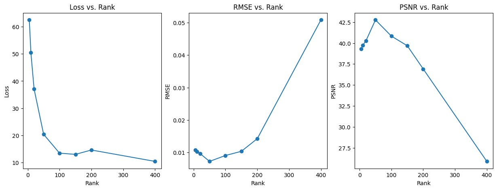

# Task-4 Image Reconstruction using Matrix Factorisation

# Question 1
Q1. Pick an image of your liking and reconstruct it using matrix factorization. Choose a suitable value for the rank r. Run Gradient Descent until it converges, plot the reconstructed image alongside the original image. Calculate and report the RMSE and PSNR metrics.

## Solution:

Initially, 30% of the chosen image was masked randomly and matrix factorization was performed to reconstruct the image using rank=50. The gradient descent converged after 5800 iterations and the reconstructed image which was formed can be shown as follows:


**Loss vs Epochs Graph:**


The following metrics were computed to evaluate the reconstruction quality:
- **RMSE** (Root Mean Squared Error) = 0.0805
- **PSNR** (Peak Signal-to-Noise Ratio) = 21.8791

## Matrix Factorization on Randomly Masked Images using Different Ranks
To find an optimal rank, I repeated the matrix factorization process with multiple ranks= [5, 10, 20, 50, 100, 150, 200, 400].

The reconstructed images can be shown as below:


Graphs illustrating Loss vs Rank, RMSE vs Rank, and PSNR vs Rank are displayed below:


From the graphs, the optimal rank was determined to be 100 for the selected grayscale image.

```
Optimal Rank and Metrics:

Rank: 100
PSNR: 22.0187
RMSE: 0.0793
```

### Analysis of Results

We can observe that the Peak Signal-to-Noise Ratio (PSNR) increases up to a certain rank (e.g., 100) and then starts decreasing as the rank continues to rise (e.g., up to 400). This behavior can be explained by the following factors:

1. **Overfitting to Noise**:
   - **Low ranks (<100):** When the rank is low, the reconstructed image provides a more compressed approximation of the original image, capturing the most significant patterns in the data but discarding finer details. This results in a low PSNR since much of the original data is lost.
   - **Optimal Rank (~100):** As the rank increases, the approximation improves because more components are able to contribute to the reconstruction of the matrix, leading to better preservation of data and an increase in PSNR.
   - **High Rank (>100):** Beyond a certain rank, the model begins to capture not only the signal (important patterns) but also the **noise** present in the image. This introduces to **overfitting**, where the approximation fits both signal and random variations (noise), leading to a degradation in reconstruction quality. As a result, the overall **signal-to-noise ratio (SNR)** decreases, which negatively impacts PSNR.
   
2. **Redundancy in the Data**: Real-world data matrices often exhibit redundancy due to correlations between pixels. As the rank increases, new components may provide diminishing returns by duplicating information already captured, leading to less meaningful improvements and causing overfitting.


### Summary

- **Initial PSNR increase**: As the rank increases, more of the significant signal is captured, improving the reconstruction and increasing the PSNR.
- **PSNR peak**: The optimal rank balances the amount of signal and noise, resulting in the best possible reconstruction.
- **PSNR decline**: At higher ranks, overfitting to noise occurs, reducing the quality of the reconstruction and causing the PSNR to drop.

To prevent this, we can use cross-validation to find the optimal rank or apply regularization to avoid overfitting at higher ranks.


## Image Reconstruction with different Mask Proportions

I experimented with different mask proportions to explore how well the image reconstruction works and plotted the graphs PSNR and RMSE vs mask proportions.


### Observations
From the above graphs, we can observe that:

1. **RMSE Increases with Mask Proportion:** As the mask proportion increases, RMSE also increases, indicating larger reconstruction errors. For example, the RMSE at 0.9 mask proportion was significantly higher (0.4861) compared to RMSE at 0.1 (0.0793).

2. **PSNR Decreases with Higher Mask Proportion:** 
   - The Peak Signal-to-Noise Ratio (PSNR), which reflects the quality of reconstruction, decreases drastically as mask proportion increases.
   - Starting from a PSNR of 22.01 at mask proportion 0.1, it falls sharply to 6.26 at 0.9, showing that higher masking worsens the quality of the reconstruction.


### Summary
- **Low Mask Proportion (0.1 to 0.3):** The image quality remains good with relatively low error values. Both PSNR and RMSE suggest acceptable reconstruction.
- **Moderate Mask Proportion (0.5):** Image quality starts to degrade, with increased RMSE and decreased PSNR.
- **High Mask Proportion (0.7 to 0.9):** The model struggles with reconstruction, as indicated by high RMSE and very low PSNR and the reconstructed image quality is likely poor.

# Question 2
Q2. Consider a case where 900 pixels (30x30) are randomly missing from an image. Reconstruct the image using matrix factorization, plot the reconstructed image, and calculate the RMSE and PSNR metrics. Next, reconstruct the same image with the missing pixels using Random Fourier Features (RFF) and Linear Regression. Compute the RMSE and PSNR for both methods, and compare the results to see which performs better.

## Solution:

A 30x30 patch was removed from a 300x300 image and matrix factorization with rank=50 was used to reconstruct the matrix with missing values. The gradient descent algorithm converged after 6260 iterations and the reconstructed image which was formed can be shown as follows:


**Loss vs Epochs Graph:**


The following metrics were computed:
- **RMSE** = 0.0078
- **PSNR** = 42.1286

## Matrix Factorization on Images with a 30x30 Masked Patch using Different Ranks

To find an optimal rank, I repeated the matrix factorization process with multiple ranks= [5, 10, 20, 50, 100, 150, 200, 400].

The reconstructed images can be shown as below:


Graphs illustrating Loss vs Rank, RMSE vs Rank, and PSNR vs Rank are displayed below:


From the above graphs, the optimal rank was found to be 50 for chosen grayscale image.

```
Optimal Rank and Metrics:

Rank: 50
RMSE: 0.0073
PSNR: 42.7642
```
From the above graphs, we can observe that:
- **Initial PSNR increase**: As the rank increases, more of the significant signal is captured, improving the reconstruction and increasing the PSNR.
- **PSNR peak**: The optimal rank balances the amount of signal and noise, resulting in the best possible reconstruction.
- **PSNR decline**: At higher ranks, overfitting to noise occurs, reducing the quality of the reconstruction and causing the PSNR to drop.


## Reconstruction using Random Fourier Features (RFF) and Linear Regression

In this section, a 30x30 patch was removed from a 300x300 image, and a coordinate map of pixel positions was created using `np.meshgrid`, resulting in an array of coordinates for each pixel in the image. Two masks were generated to identify known (non-missing) and missing (NaN) pixel locations. The known pixel coordinates and their values were extracted, and the coordinates were scaled to the range of (-1, 1) using `MinMaxScaler`, for effective training of the model. 

Random Fourier Features (RFF) were then applied to these scaled coordinates to create a new feature space of 40,000 features with a sigma value of 1, allowing for the capture of non-linear relationships. A Ridge regression model was fitted using the transformed RFF features and their corresponding known pixel values.

Ridge regression was favored over standard linear regression due to its capacity to manage multicollinearity and provide more reliable estimates in the presence of noise. By incorporating an L2 penalty, Ridge regression reduces the influence of less critical features, enhancing overall prediction accuracy. The RFF transformation often results in highly correlated features, where Ridge regression's regularization mitigates overfitting, resulting in better generalization to unseen data.

After training the Ridge regression model, predictions for the missing pixel values were made by transforming the coordinates of the masked region with RFF and applying the trained Ridge regression model. Then, the original image was reconstructed by filling in the missing values with the predicted data.

This process was conducted separately for each color channel (Red, Green, and Blue), and the outputs were combined to produce the final reconstructed colored image, as shown below:


```
The RMSE (Root Mean Squared Error) and PSNR (Peak Signal-to-Noise Ratio) were calculated follows:
RMSE: 0.0124
PSNR: 38.1173
```

## Comparison between Matrix Factorization and (RFF + Regression)

However, the results from RFF and regression were not as effective compared to those obtained through matrix factorization. The matrix factorization method better captured the underlying patterns in the data and provided more accurate reconstructions. In contrast, the RFF and Ridge approach struggled to take full advantage of the spatial correlations present in the image, resulting in poorer results.

## Conclusion

In conclusion, matrix factorization proves to be particularly effective for scenarios involving missing data. By breaking down the image into lower-dimensional representations, it captures the underlying structure of the data, leading to better prediction of the missing values. The ability of matrix factorization to effectively model the essential patterns in the data makes it a preferred choice for image reconstruction and compression tasks.