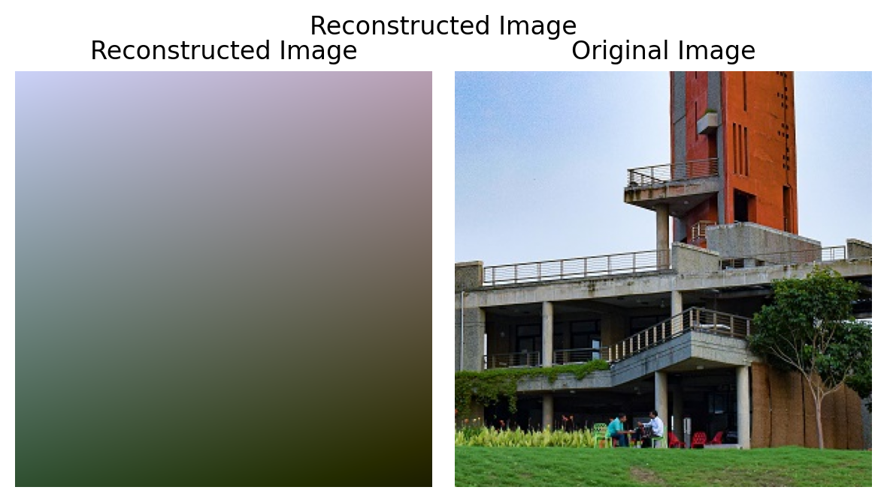
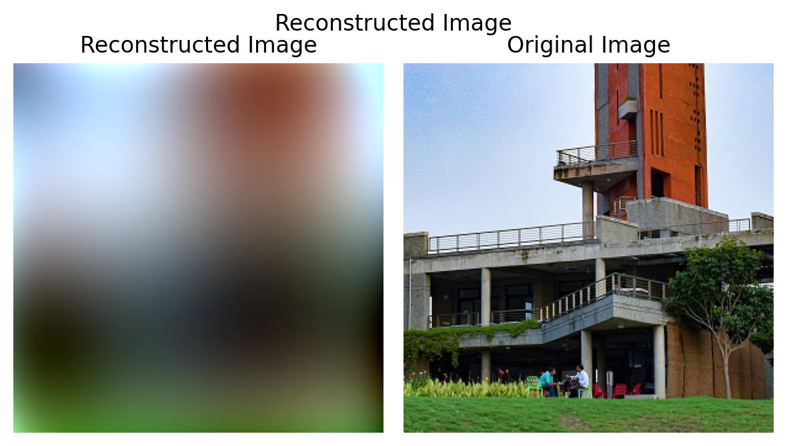
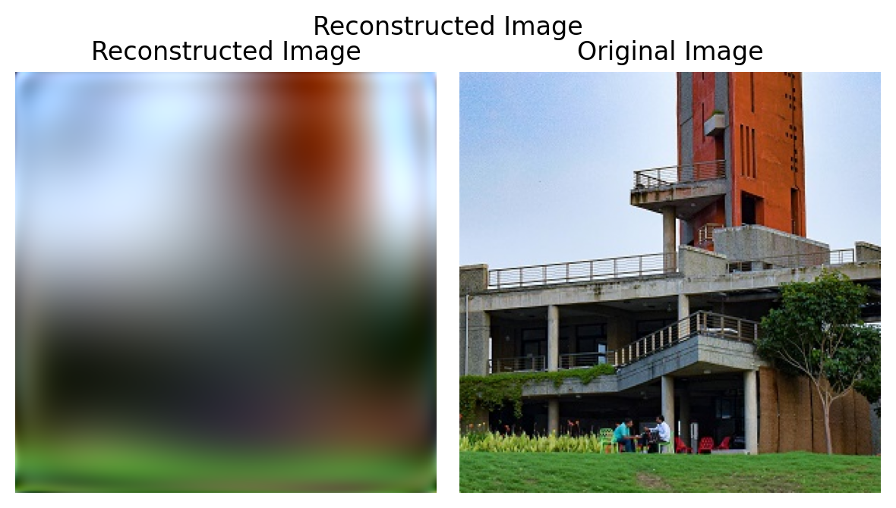
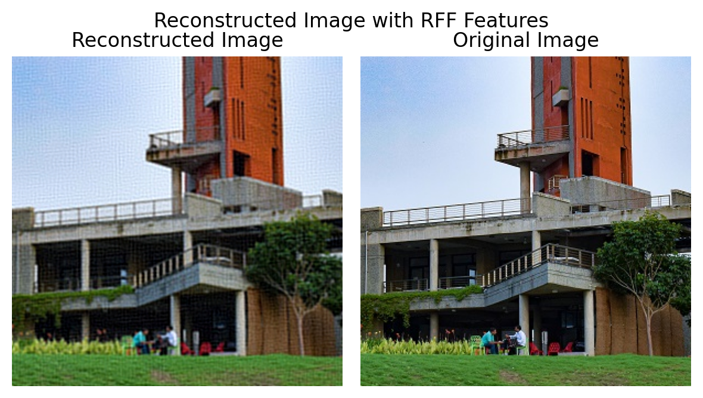
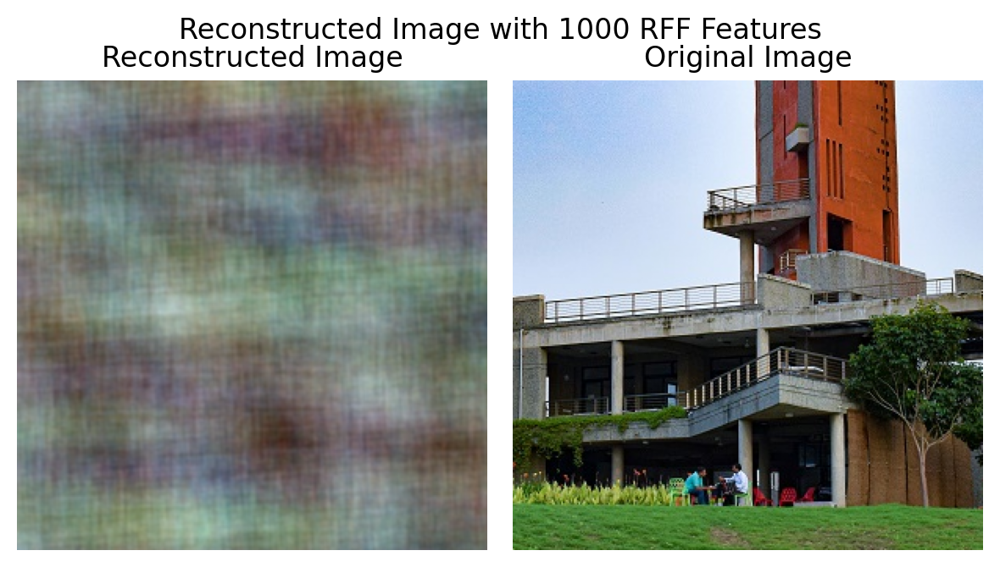
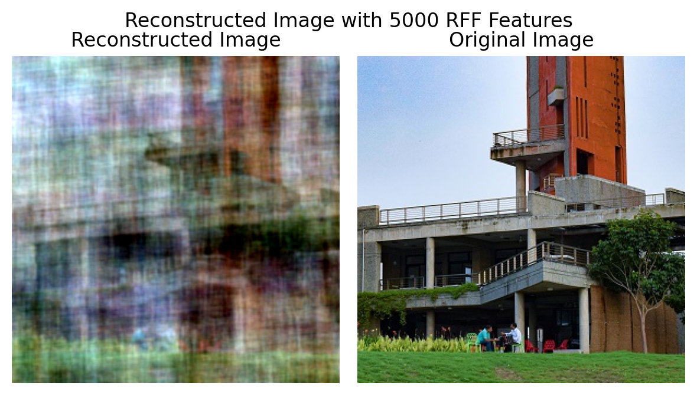
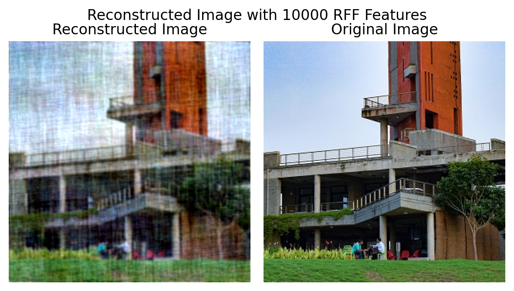
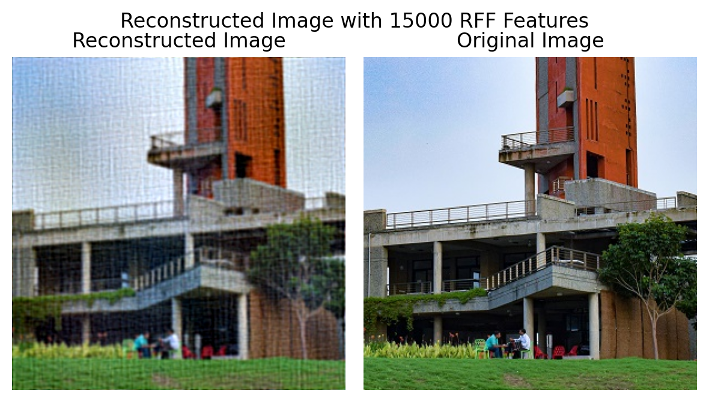
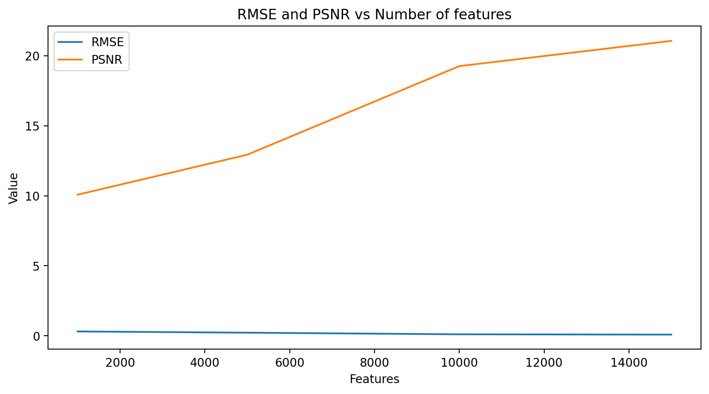
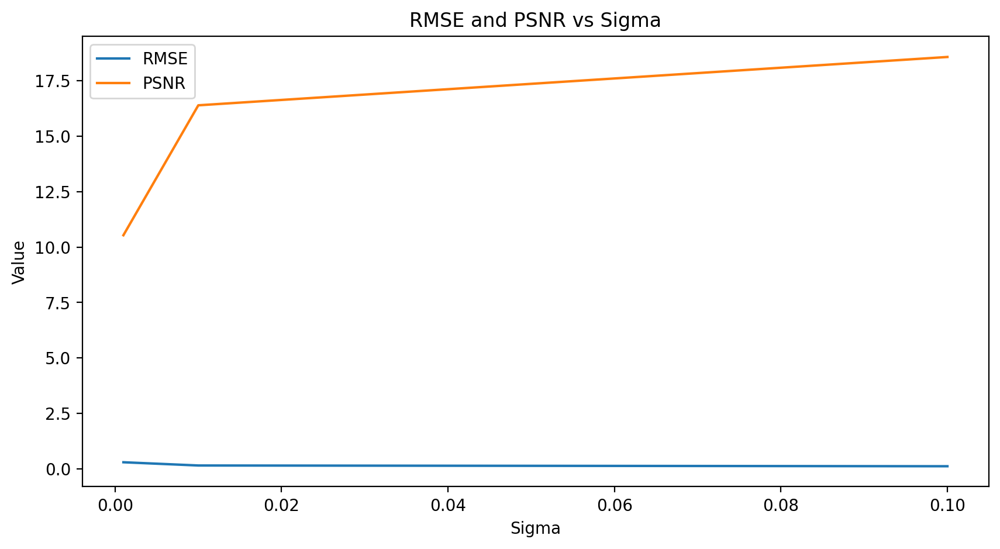

# Task 2: Image and Audio Reconstruction Project

This project covers two main tasks: Image Reconstruction and Audio Reconstruction, using **Random Fourier Features (RFF)** and **Linear Regression**. The goal is to demonstrate the use of RFF in learning the mapping from coordinates to pixel colors for images and from time to amplitude for audio. The project also includes an evaluation of the reconstruction quality using **RMSE**, **PSNR** for images, and **SNR** for audio.

## What is RBF Sampling?

Random Fourier Features (RFF) approximate kernel functions (such as the Radial Basis Function (RBF) kernel) by mapping input data into a higher-dimensional feature space. This allows linear models to approximate non-linear relationships. 

### Formula for RBF Kernel:
The RBF kernel between two points $\( x \)$ and $\( x' \)$ is given by:

$$\[
K(x, x') = \exp \left( -\frac{\|x - x'\|^2}{2\sigma^2} \right)
\]$$

Where:
- $\( \sigma \)$ is the kernel width (a hyperparameter).
- $\( \|x - x'\|^2 \)$ is the squared Euclidean distance between the two points.

In **RFF**, we approximate this kernel by projecting the input data into a random feature space. The transformation is defined as:

$$\[
z(x) = \sqrt{\frac{2}{D}} \cos(Wx + b)
\]$$

Where:
- $\( W \)$ is a matrix of random samples drawn from a Gaussian distribution.
- $\( b \)$ is a vector of random biases.
- $\( D \)$ is the dimensionality of the random feature space.

Using these features, we can apply a simple linear model to approximate non-linear relationships.

---
### Importance of Keeping the Same `random_state` for RFF Creation

When generating Random Fourier Features using the `RBFSampler`, it’s crucial to fix the `random_state` parameter for reproducibility. Without a fixed `random_state`, the random samples used to approximate the RBF kernel will differ on every execution, leading to different feature transformations, which could result in inconsistent model performance and evaluation metrics.

By setting a `random_state`, you ensure:
1. **Consistency**: The model always works with the same random features, allowing for reproducible results.This is **the most** important factor when considering Image SuperResoltuion.
2. **Fair Comparison**: When you tune hyperparameters (like the number of components or sigma), keeping the `random_state` fixed ensures you're comparing models fairly on the same feature transformation.

```python
# Example: Setting a fixed random state
rbf_sampler = RBFSampler(gamma=1.0, n_components=500, random_state=42)
X_features = rbf_sampler.fit_transform(X)
```

**Importance of Epoch Number During Training**-

The number of epochs (iterations over the entire dataset) is crucial in model training as it affects the convergence and performance of the model:

-Underfitting: If the model is trained for too few epochs, it may not have enough iterations to learn the underlying patterns, leading to underfitting (poor training and test performance).
-Overfitting: On the other hand, if the model is trained for too many epochs, it may start to overfit the training data, capturing noise and reducing generalization on unseen data.
-Optimal Epoch: A balance must be struck by using techniques like early stopping, where training is halted when the validation error stops decreasing, ensuring the model generalizes well.

## Task 2 (i): Image Reconstruction

This task involves reconstructing an image by learning the mapping from pixel coordinates $\( (X, Y) \)$ to pixel colors $\( (R, G, B) \)$ using Random Fourier Features and Linear Regression.

### Steps Involved:

#### 1. Training on Coordinate Map Directly:
- We trained the model directly on pixel coordinates $\( (X, Y) \)$, but the reconstruction quality was poor.


#### 2. Polynomial Bias:
- Added polynomial bias terms to the input coordinates to capture more complex relationships. This showed some improvement but was still not sufficient.




#### 3. Using RBF Sampler (Random Fourier Features):
- -We transformed the coordinates $\( (X, Y) \)$ into a higher-dimensional space using an RBF sampler. 
  
  
- By experimenting with different values of $\( \sigma \)$ and the number of components, we achieved significantly better results.And got an idea of the relation between sigma and number of features with image quality.

**Parameter:Number of features:**






**Parameter:Sigma**




#### Metrics:
- **RMSE (Root Mean Squared Error)**: Measures the error between the original and reconstructed images.
  
$$\[
RMSE = \sqrt{\frac{1}{N} \sum_{i=1}^{N} (I_{orig}(i) - I_{rec}(i))^2}
\]$$

Where $\( N \)$ is the number of pixels, $\( I_{orig}(i) \)$ is the original pixel value, and $\( I_{rec}(i) \)$ is the reconstructed pixel value.

- **PSNR (Peak Signal-to-Noise Ratio)**: Evaluates the quality of the reconstructed image compared to the original. It is given by:

$$\[
PSNR = 20 \cdot \log_{10} \left( \frac{MAX_{I}}{RMSE} \right)
\]$$

Where $\( MAX_{I} \)$ is the maximum possible pixel value (e.g., 255 for 8-bit images).

### Why PSNR for Images?
PSNR is widely used for image reconstruction tasks because it measures the ratio between the maximum possible pixel value and the reconstruction error. A higher PSNR indicates a closer resemblance between the reconstructed and original image.

---

## Task 2 (ii): Audio Reconstruction

This task involves reconstructing a 5-second audio sample by learning the mapping from time $\( t \)$ to amplitude $\( A \)$ using Random Fourier Features and Linear Regression.

### Steps Involved:

#### 1. Downloading and Processing Audio:
- The audio is downloaded using `yt-dlp` and processed using `pydub` to crop a 5-second sample.

#### 2. Loading and Analyzing Audio:
- The audio is loaded using `librosa`, and its waveform and frequency spectrum are visualized.

#### 3. Applying RFF and Linear Regression:
- We applied RFF to map the time $\( t \)$ to a higher-dimensional space and trained a Linear Regression model to learn the mapping from $\( t \)$ to $\( A \)$.

#### Metrics:
- **RMSE (Root Mean Squared Error)**: Similar to image reconstruction, RMSE quantifies the reconstruction error between the original and reconstructed audio.

- **SNR (Signal-to-Noise Ratio)**: Evaluates the quality of the reconstructed audio by comparing the signal's power to the noise's power. It is given by:

$$\[
SNR = 10 \cdot \log_{10} \left( \frac{P_{signal}}{P_{noise}} \right)
\]$$

Where $\( P_{signal} \)$ is the power of the original signal and $\( P_{noise} \)$ is the power of the noise (difference between the original and reconstructed signals).

### Why SNR for Audio?
SNR is commonly used for audio signals as it measures the clarity of the signal relative to the background noise. A higher SNR indicates better audio reconstruction quality.

---

## Results and Observations:

### Image Reconstruction:
- **Direct Coordinate Mapping**: Poor results due to limited model capacity.
- **Polynomial Bias**: Improved structure but lacked fine detail.
- **RFF (with varying $\( \sigma \)$ and components)**: Significant improvement in capturing details and overall structure.

### Audio Reconstruction:
- **Original vs Reconstructed**: The reconstructed audio closely resembles the original, with minor errors in amplitude.
- **RMSE**: {{ RMSE_value }} for image reconstruction, {{ RMSE_value_audio }} for audio reconstruction.
- **PSNR**: {{ PSNR_value }} dB for images.
- **SNR**: {{ SNR_value }} dB for audio.

---

## Requirements:
- Python 3.x
- PyTorch
- Scikit-learn (`RBFSampler`)
- Matplotlib
- Numpy
- Librosa
- yt-dlp
- Pydub

## Usage:

1. Clone the repository:
   ```bash
   git clone https://github.com/your-repo/image-audio-reconstruction.git
   cd image-audio-reconstruction
