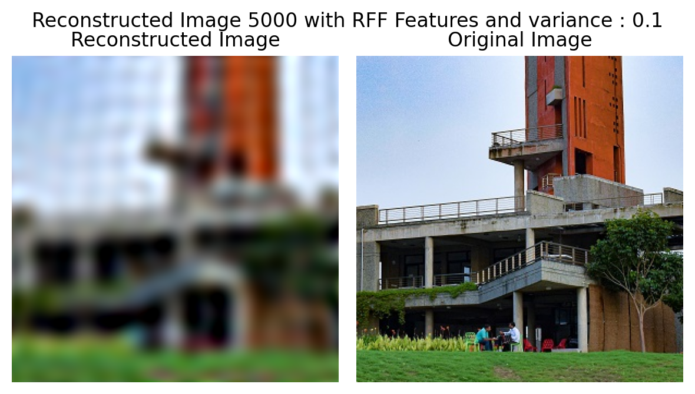

# Image Super-Resolution using Random Fourier Features and Linear Regression

## Overview
This project performs image super-resolution to enhance the resolution of a given image by a factor of 2. The methodology involves downsampling the original high-resolution image, using Random Fourier Features (RFF) and linear regression to predict the high-resolution image, and comparing the results both qualitatively and quantitatively.

## Task Instructions

Perform super-resolution on the given image to enhance its resolution by a factor of 2. Display the original and reconstructed images side-by-side for a qualitative  comparison. Give RMSE and PSNR for quantitative comparison.

#### Implementation Highlights:
- **Input Image**: The 400x400 high-resolution image.
- 

  

- **Downsampling**: Resize to 200x200 to create the low-resolution image.

  

- **Feature Extraction**: Use RFF to transform the low-resolution image.
  
- **Linear Regression**: Train a model to learn the mapping between low and high resolution.

### Importance of Random State

#### The Wrong Way:
Implementing RFF without setting a random state can lead to inconsistent results in the transformed features, resulting in variations in the predicted high-resolution images.

  

**What's wrong?**:
- Without a fixed random state, each run will produce a different set of random Fourier features, causing the model's predictions to vary unpredictably. This inconsistency makes it hard to evaluate the model's true performance.

  

  

<!--  -->

**Why `random_state` is important**:
- The `random_state` parameter ensures reproducibility by controlling the randomness in operations like feature transformation. By fixing the random state, the same set of features and predictions can be obtained each time the code is run, which is crucial for consistent model evaluation and debugging.

#### The Correct Way:
Set a fixed `random_state` (or seed) when creating random features. This guarantees that the same random features are used every time, leading to consistent and reproducible results.

  

  

  

